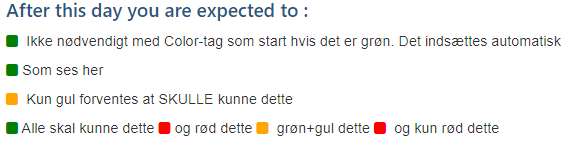

# Index

- [How to use the automatic link-capture feature](#how-to-autoharvest-links)
- [Overriding a lecture](#overriding-a-lecture)
- [Learning Goals](#learning-goals)
- [How this site is implemented](#how-this-site-is-implemented)

_In progress_

<hr/>

## <a id="how-to-autoharvest-links"></a> How to use the automatic link-capture feature
One of the major reasons to use this system (if not the only) is the ability to easily make lists of relevant material so students always, with a maximum of 2-3 clicks, can find what they need. These are the features offered by the system:
- Mark a page as a studypoint exercise and automatically create a list of all these exercises given that week
  - Add this field to the frontmatter `isSP: true`
  - Add this tag to insert links to all exercises this week `<!--PeriodExercises Flow-1/week1 PeriodExercises-->` (Flow and Week MUST match the real folder names)

- Insert Links to **exercises** that automatically will be added to a list of all exercises given this semester. Surround the link(s) as sketched below:
```
<!--BEGIN exercises ##-->
[Link Txt](#Url)
.... More links if you like
<!--END exercises ##-->
```
- Insert Links to **references** that automatically will be added to a list of all references given this semester. Surround the link(s) as sketched below (use &#58;book&#58; :book: or &#58;tv&#58; :tv: to indicate read or watch):
```
<!--BEGIN readings ##-->
:book: [txt (n-y min)](#url)
:tv: [txt (estimated time)](#url)
<!--END readings ##-->
```
- Insert Links to **guidelines** that automatically will be added to a list of all guidelines given this semester
```
<!--BEGIN guides ##--> ... Links to guides <!--END guides ##-->
```
- Insert Links to **slides* that automatically will be added to a list of all slides given this semester
```
<!--BEGIN slides ##--> ... Links to guides <!--END slides ##-->
```
- Insert Links to **exam-preparation exercises** that automatically will be added to a list of all exam-preparation exercises given this semester
```
<!--BEGIN exam-prep ##--> ... Links to exam preparation exercise <!--END exam-prep ##-->
```
- Add a **link to more than one list**. The example below will add the link both to the list of all exercises, and the list of all guidelines:
```
<!--BEGIN exercises_guides ##-->
... Links
<!--END exercises_guides ##-->
```
*Any link, in any of the tags given above, will only be added once. So if a guideline, exercise etc. is used more than once it will not overflow the list's with duplicate links*

## <a id="overriding-a-lecture"></a> How to override a specific lesson (day)
Individual days can be overriden to provide teacher specific material and references

This is done simply by creating a folder for the given week in the relevant week-folder with the name of the class (a, b, c ..) and copy the original md-file (for example 19-08-2019.md) into this folder. Now the teacher specific changes can be made and this page will ONLY be seen by students having selected this class.

The following rules apply to overridden pages:
- Learning goals can not be overridden. If you try, they will just be "dumped"
- Weekly exercises, given in an override, will be used in the automatic capture for the weeks Friday exercises
- references, exercises, slides and guidelines given in an overridden page will be used by the automatic link-capture feature to build the link-lists, Not links given in the "master"


## <a id="learning-goals"></a> Learning Goals

Learning goals are added, line by line (one goal = one line) to the frontmatter via a property **goals** as shown below

Note: The initial space/tab before each goal is **VERY IMPORTANT**, without the page will fail and not be included in the menu
```
---
title: "xxx"
date: "<xx-xx-xxxx"
pageintro: ""
goals: |
  [:g:] Ikke nødvendigt med Color-tag som start hvis det er grøn. Det indsættes automatisk
  Som ses her
  [:y:] Kun gul forventes at SKULLE kunne dette
  Alle skal kunne dette [:r:]og rød dette [:y:] grøn+gul dette [:r:] og kun rød dette
---
```
*The example above will insert this in the final page (above your own text)*



### Learning Goals and overridden pages (pages for a specific class)
If you override the specification for a lecture, you will normally copy all content into the overridden folder to get started. You don't need to copy the learning goals, since they will be removed, and the original ones used.

*The reason is that learning goals should be the same for all  classes, no matter how things are presented*

## <a id="how-this-site-is-implemented"></a> About Gatsby and React that "powers" this site

TBD


